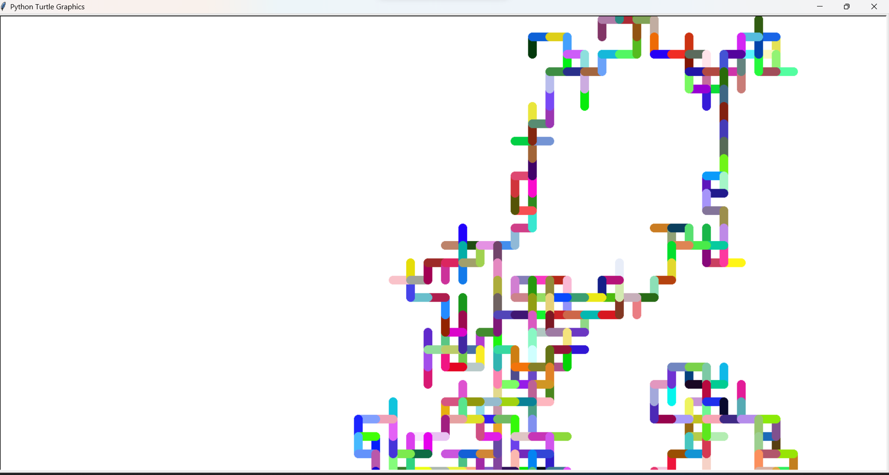
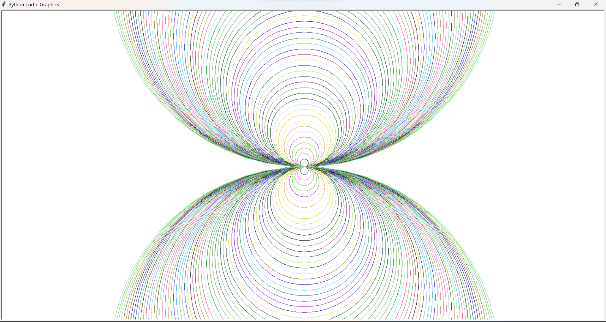
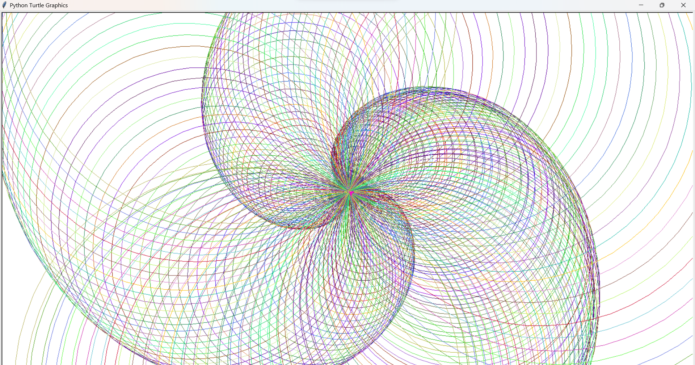
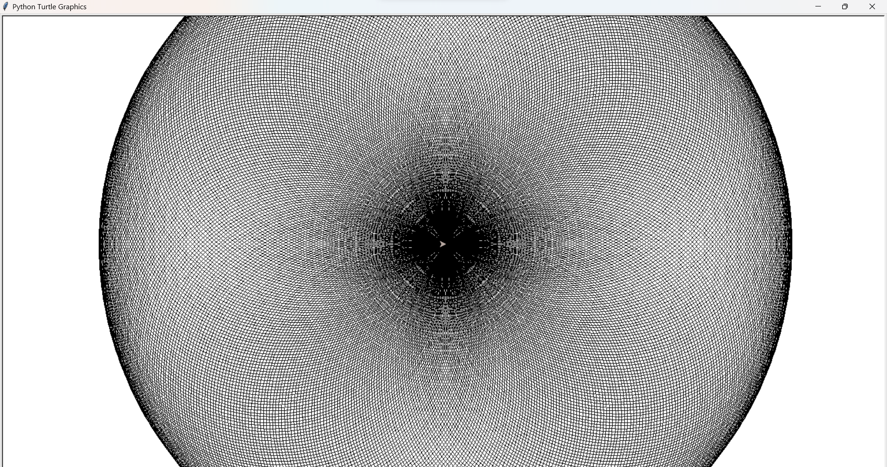
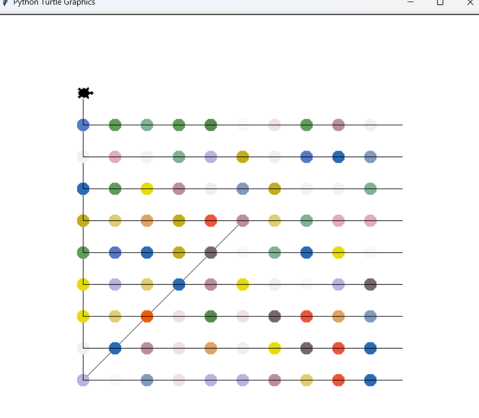
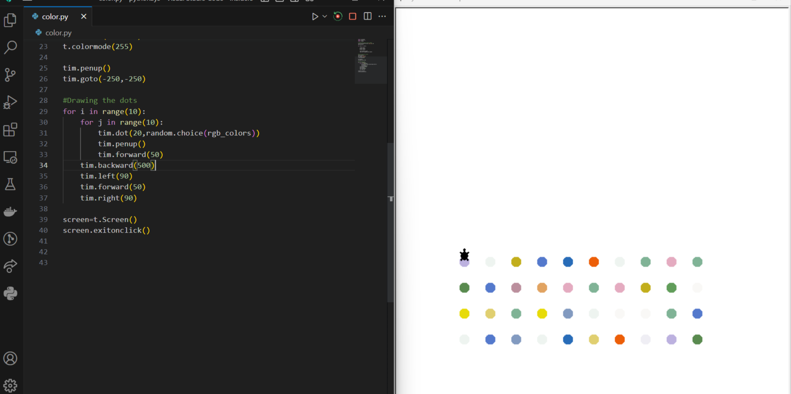
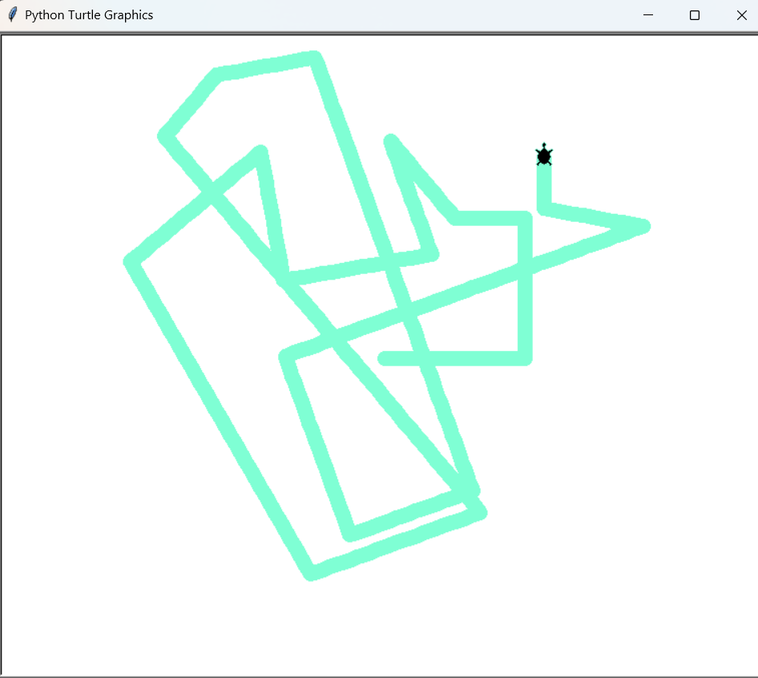
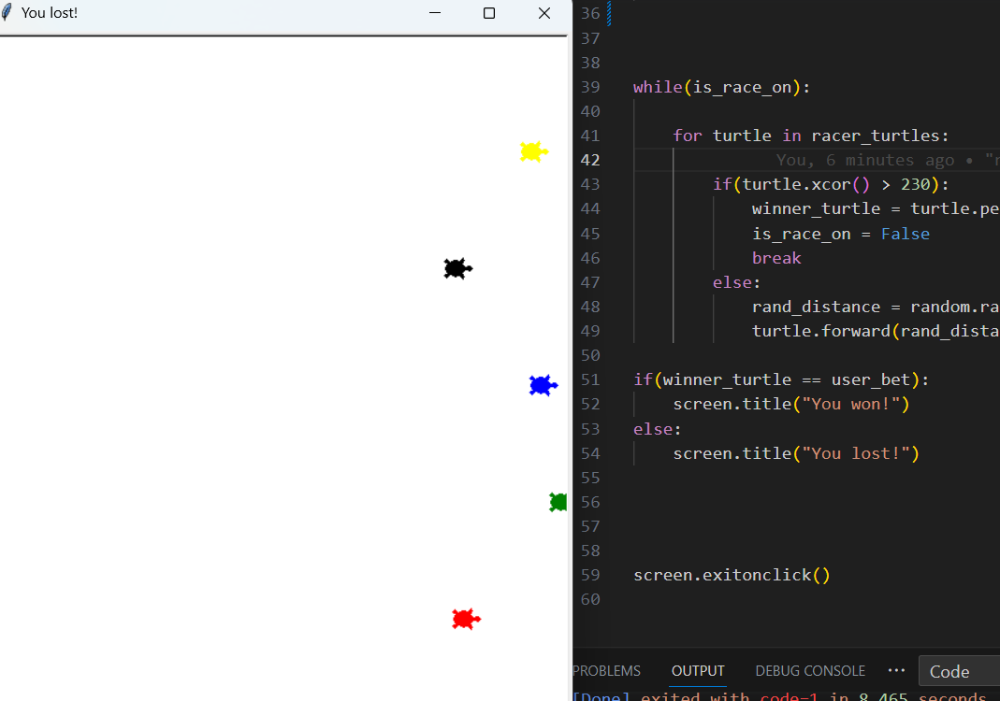

# Turtle

## Random walk!?
Random walks occur in nature across various phenomena, including physics, biology, finance, and more. A random walk is a mathematical model that describes the path of an object or a system that undergoes successive random steps. It involves a series of steps taken in random directions or with random magnitudes.

Mathematically, a simple random walk can be described using the following equation:

X(t) = X(0) + Σᵢᵗ Z(i)

where:
X(t) represents the position of the walker at time t.
X(0) represents the initial position of the walker.
Σᵢᵗ Z(i) represents the sum of random variables Z(i) from i = 1 to t. Z(i) denotes the random step taken at each time step.

## How are random numbers generated in computer programs?

Random numbers in computer code are typically generated using algorithms known as pseudo-random number generators (PRNGs). These algorithms produce sequences of numbers that appear random but are generated deterministically from a seed value. The seed value serves as the starting point for the algorithm, and by iterating through a series of calculations, the PRNG generates a sequence of numbers that exhibit statistical properties resembling randomness.

However, it's important to note that PRNG-generated numbers are not truly random as they are ultimately based on deterministic computations. For many applications, the level of pseudo-randomness provided by PRNGs is sufficient. To generate better pseudo-random numbers, PRNGs often utilize various mathematical techniques, such as iterating through complex mathematical formulas or using the current system time as part of the seed.

~* For applications requiring true randomness, specialized hardware or external sources of randomness, such as atmospheric noise or radioactive decay, are used to generate random numbers. These sources provide a basis for genuinely unpredictable outcomes.

## SpiroGraphs
A spirograph is a geometric drawing toy consisting of gears, rings, and a pen or pencil. It allows users to create intricate and mesmerizing patterns known as spirographs or hypotrochoids. By rotating a smaller gear inside a larger one, the pen or pencil attached to the smaller gear traces out a beautiful pattern as it moves along the inside or outside of the larger gear.

The mathematical significance of a spirograph lies in the fascinating curves it produces. These curves, known as hypotrochoids and epitrochoids, are actually a specific type of mathematical shape called trochoids. Trochoids are curves traced by a point on a smaller circle rolling inside or outside a larger fixed circle. Spirographs are a practical application of trochoids.

The equation describing a hypotrochoid is given by:

x(t) = (R - r) * cos(t) + d * cos((R - r) * t / r)
y(t) = (R - r) * sin(t) - d * sin((R - r) * t / r)

where:
R represents the radius of the larger fixed circle.
r represents the radius of the smaller rolling circle.
d represents the distance of the pen or pencil from the center of the smaller circle.
t represents the parameter that determines the position along the curve.
  

## Contemporary Art

Contemporary art refers to the art created by artists of the present time or within the recent past. It is a diverse and evolving field that encompasses a wide range of artistic practices, styles, and mediums. Unlike art movements of the past, contemporary art does not adhere to a specific style or set of rules.

Artists basically create random stuff and sell it. These auctions are in millions of dollars. The world is a crazy place.

## Turtle sketch

You could control the pen of the turtle and make it draw whatever you like. Just use WASD and C to clear.

## Turtle race

Gamble on your luck. Decide who is going to win the race and win turtle dollars
